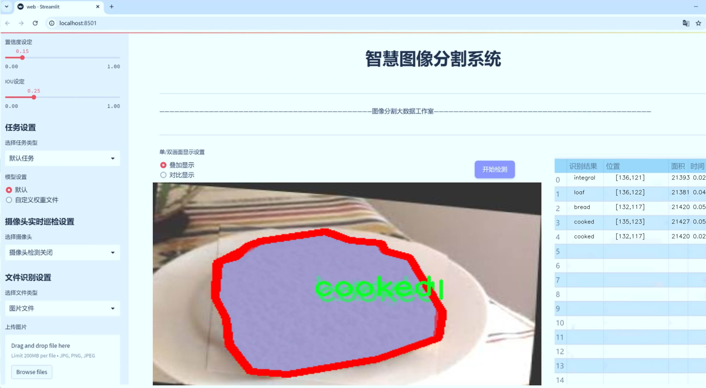
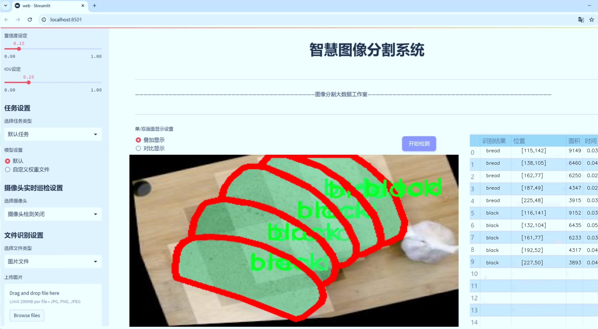
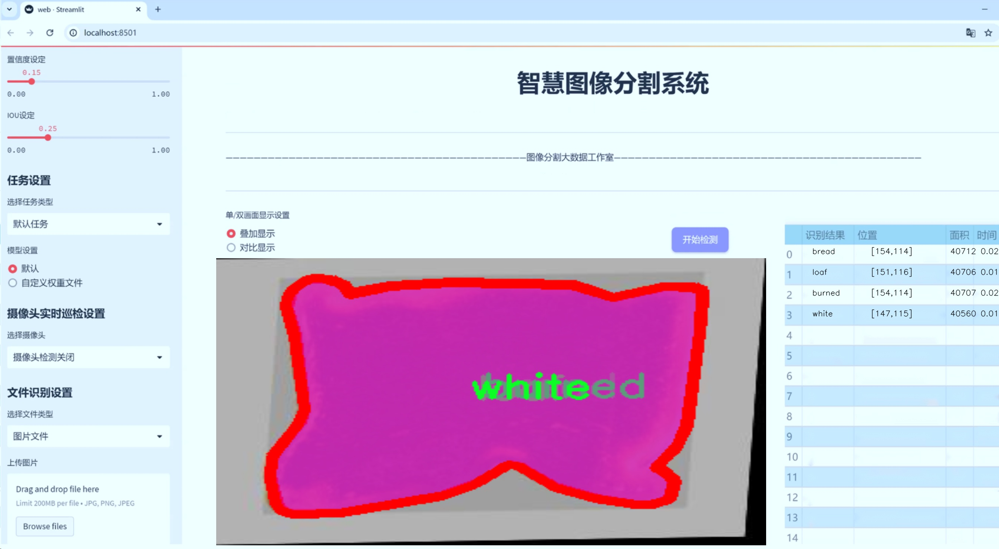
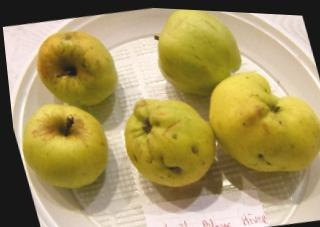
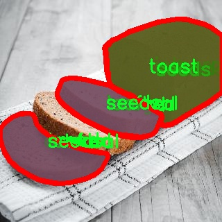
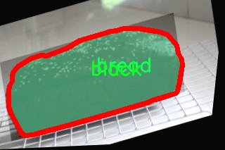
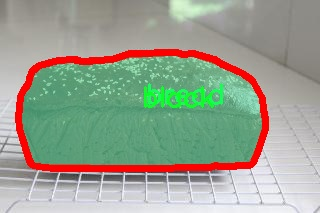
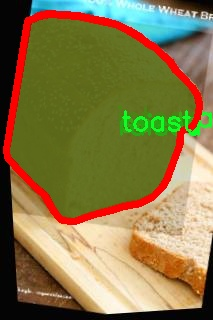

# 面包种类分割系统源码＆数据集分享
 [yolov8-seg-C2f-ODConv＆yolov8-seg-goldyolo等50+全套改进创新点发刊_一键训练教程_Web前端展示]

### 1.研究背景与意义

项目参考[ILSVRC ImageNet Large Scale Visual Recognition Challenge](https://gitee.com/YOLOv8_YOLOv11_Segmentation_Studio/projects)

项目来源[AAAI Global Al lnnovation Contest](https://kdocs.cn/l/cszuIiCKVNis)

研究背景与意义

随着食品工业的快速发展，面包作为一种重要的主食，其种类和生产工艺日益丰富。面包的多样性不仅体现在口味和外观上，更在于其制作过程中的原材料、发酵方式和烘焙技术等方面。为了满足消费者日益增长的个性化需求，面包生产企业亟需一种高效、准确的分类和分割系统，以便在生产、销售和质量控制等环节中进行有效管理。传统的人工分类方法不仅耗时耗力，而且容易受到人为因素的影响，导致分类结果的不准确。因此，基于计算机视觉技术的自动化面包种类分割系统应运而生，成为研究的热点。

在众多计算机视觉算法中，YOLO（You Only Look Once）系列模型因其高效的实时目标检测能力而受到广泛关注。YOLOv8作为该系列的最新版本，具备更强的特征提取能力和更快的推理速度，能够在复杂的场景中实现精准的目标检测与分割。针对面包种类的特征，YOLOv8的改进版本可以通过优化网络结构和训练策略，提升对不同种类面包的识别精度和分割效果。尤其是在面包种类繁多的情况下，YOLOv8的实例分割能力能够有效区分相似外观的面包类型，从而实现高效的分类和质量控制。

本研究的核心在于构建一个基于改进YOLOv8的面包种类分割系统，利用包含1600张图像和16个类别的面包数据集进行训练和验证。该数据集涵盖了多种面包类型，包括法棍、黑面包、圆面包等，能够充分反映面包的多样性和复杂性。通过对这些图像进行深度学习训练，系统将能够自动识别和分割不同种类的面包，为面包生产企业提供精准的分类依据。

此外，本研究的意义还在于推动计算机视觉技术在食品行业的应用，提升面包生产的智能化水平。通过自动化的面包种类分割系统，企业不仅可以提高生产效率，降低人工成本，还能够在质量控制中实现更高的标准化，确保消费者获得高品质的产品。同时，该系统的成功应用也为其他食品类别的自动化分类提供了借鉴，推动了食品工业的数字化转型。

综上所述，基于改进YOLOv8的面包种类分割系统的研究，不仅具有重要的理论价值，还具备广泛的实际应用前景。通过深入探索计算机视觉技术在面包分类中的应用，能够为面包生产企业提供更为高效的解决方案，促进食品行业的可持续发展。

### 2.图片演示







##### 注意：由于此博客编辑较早，上面“2.图片演示”和“3.视频演示”展示的系统图片或者视频可能为老版本，新版本在老版本的基础上升级如下：（实际效果以升级的新版本为准）

  （1）适配了YOLOV8的“目标检测”模型和“实例分割”模型，通过加载相应的权重（.pt）文件即可自适应加载模型。

  （2）支持“图片识别”、“视频识别”、“摄像头实时识别”三种识别模式。

  （3）支持“图片识别”、“视频识别”、“摄像头实时识别”三种识别结果保存导出，解决手动导出（容易卡顿出现爆内存）存在的问题，识别完自动保存结果并导出到tempDir中。

  （4）支持Web前端系统中的标题、背景图等自定义修改，后面提供修改教程。

  另外本项目提供训练的数据集和训练教程,暂不提供权重文件（best.pt）,需要您按照教程进行训练后实现图片演示和Web前端界面演示的效果。

### 3.视频演示

[3.1 视频演示](https://www.bilibili.com/video/BV12KDfYrEHQ/)

### 4.数据集信息展示

##### 4.1 本项目数据集详细数据（类别数＆类别名）

nc: 18
names: ['baguette', 'black', 'bread', 'bun', 'burned', 'cooked', 'integral', 'loaf', 'no_seeds', 'oblong', 'raised', 'round', 'seeds', 'semi-cooked', 'toast', 'uncooked', 'under', 'white']


##### 4.2 本项目数据集信息介绍

数据集信息展示

在本研究中，我们使用了名为“bread_segmentation”的数据集，旨在改进YOLOv8-seg模型的面包种类分割系统。该数据集包含18个不同的面包类别，涵盖了多种面包的形态和特征，为模型的训练提供了丰富的样本和多样化的场景。这些类别包括：法棍（baguette）、黑面包（black）、普通面包（bread）、小圆面包（bun）、烧焦面包（burned）、熟面包（cooked）、全麦面包（integral）、面包条（loaf）、无籽面包（no_seeds）、椭圆形面包（oblong）、发酵面包（raised）、圆形面包（round）、有籽面包（seeds）、半熟面包（semi-cooked）、吐司（toast）、生面包（uncooked）、底部面包（under）以及白面包（white）。这些类别的多样性不仅反映了面包的丰富文化和制作工艺，也为计算机视觉模型的训练提供了良好的基础。

在数据集的构建过程中，确保了每个类别的样本数量均衡，旨在避免模型在训练过程中对某些类别的偏倚。数据集中的图像均经过精心挑选，确保其在不同的光照条件、背景和拍摄角度下均能有效地表现出各类面包的特征。这种多样性对于模型的泛化能力至关重要，使得训练后的模型能够在实际应用中准确识别和分割不同种类的面包。

为了进一步增强数据集的有效性，我们在数据预处理阶段进行了图像增强，包括旋转、缩放、裁剪和颜色调整等操作。这些技术的应用不仅增加了数据集的样本数量，还提高了模型对各种可能变换的鲁棒性。此外，数据集还包括了一些标注信息，确保每张图像中面包的轮廓和类别标签清晰可见，这为后续的训练和评估提供了必要的支持。

在训练过程中，我们将采用交叉验证的方法，以确保模型在不同数据子集上的表现一致性。通过对“bread_segmentation”数据集的深入分析和训练，我们期望能够显著提高YOLOv8-seg模型在面包种类分割任务中的准确性和效率。最终目标是实现一个高效的面包种类识别系统，不仅能够满足工业生产的需求，还能为消费者提供更为精准的面包分类信息。

总之，“bread_segmentation”数据集为本研究提供了一个坚实的基础，凭借其丰富的类别和多样的样本，结合先进的深度学习技术，我们有信心在面包种类分割领域取得显著的进展。这一数据集的成功应用将为面包行业的自动化和智能化发展提供重要的技术支持，同时也为相关领域的研究者提供了宝贵的参考资料。











### 5.全套项目环境部署视频教程（零基础手把手教学）

[5.1 环境部署教程链接（零基础手把手教学）](https://www.bilibili.com/video/BV1jG4Ve4E9t/?vd_source=bc9aec86d164b67a7004b996143742dc)


[5.2 安装Python虚拟环境创建和依赖库安装视频教程链接（零基础手把手教学）](https://www.bilibili.com/video/BV1nA4VeYEze/?vd_source=bc9aec86d164b67a7004b996143742dc)

### 6.手把手YOLOV8-seg训练视频教程（零基础小白有手就能学会）

[6.1 手把手YOLOV8-seg训练视频教程（零基础小白有手就能学会）](https://www.bilibili.com/video/BV1cA4VeYETe/?vd_source=bc9aec86d164b67a7004b996143742dc)


按照上面的训练视频教程链接加载项目提供的数据集，运行train.py即可开始训练



     Epoch   gpu_mem       box       obj       cls    labels  img_size
     1/200     0G   0.01576   0.01955  0.007536        22      1280: 100%|██████████| 849/849 [14:42<00:00,  1.04s/it]
               Class     Images     Labels          P          R     mAP@.5 mAP@.5:.95: 100%|██████████| 213/213 [01:14<00:00,  2.87it/s]
                 all       3395      17314      0.994      0.957      0.0957      0.0843

     Epoch   gpu_mem       box       obj       cls    labels  img_size
     2/200     0G   0.01578   0.01923  0.007006        22      1280: 100%|██████████| 849/849 [14:44<00:00,  1.04s/it]
               Class     Images     Labels          P          R     mAP@.5 mAP@.5:.95: 100%|██████████| 213/213 [01:12<00:00,  2.95it/s]
                 all       3395      17314      0.996      0.956      0.0957      0.0845

     Epoch   gpu_mem       box       obj       cls    labels  img_size
     3/200     0G   0.01561    0.0191  0.006895        27      1280: 100%|██████████| 849/849 [10:56<00:00,  1.29it/s]
               Class     Images     Labels          P          R     mAP@.5 mAP@.5:.95: 100%|███████   | 187/213 [00:52<00:00,  4.04it/s]
                 all       3395      17314      0.996      0.957      0.0957      0.0845


### 7.50+种全套YOLOV8-seg创新点代码加载调参视频教程（一键加载写好的改进模型的配置文件）

[7.1 50+种全套YOLOV8-seg创新点代码加载调参视频教程（一键加载写好的改进模型的配置文件）](https://www.bilibili.com/video/BV1Hw4VePEXv/?vd_source=bc9aec86d164b67a7004b996143742dc)

### 8.YOLOV8-seg图像分割算法原理

原始YOLOv8-seg算法原理

YOLOv8-seg算法是Ultralytics团队在YOLOv5的基础上，经过多次迭代和优化后于2023年1月推出的一种先进的目标检测与实例分割模型。作为YOLO系列的最新版本，YOLOv8-seg不仅在目标检测任务中表现出色，还扩展了对图像分割的支持，使其在计算机视觉领域中具有更广泛的应用潜力。YOLOv8-seg的设计理念旨在兼顾实时性与准确性，特别适用于需要快速反应的应用场景，如自动驾驶、智能监控和机器人视觉等。

YOLOv8-seg的核心创新体现在其网络结构、损失函数和检测头的设计上。首先，在网络结构方面，YOLOv8-seg采用了新的骨干网络，并将传统的C3模块替换为C2f模块。C2f模块引入了更多的跳层连接，增强了梯度流动，从而提高了模型的学习能力和收敛速度。与之前的YOLO版本相比，C2f模块的设计不仅保持了轻量化的优势，还在特征提取的过程中引入了更多的上下文信息，这对于分割任务尤为重要，因为分割需要更精细的特征表达来准确划分目标边界。

在颈部网络中，YOLOv8-seg继续采用C2f模块，进一步简化了网络结构，删除了多余的卷积连接层，从而减少了计算复杂度，提高了推理速度。这种设计使得YOLOv8-seg在保持高精度的同时，能够实现更快的推理速度，适应实时应用的需求。

YOLOv8-seg的头部网络采用了YOLOX中的解耦头设计，分为两个并行分支，分别负责提取类别和位置特征。这种解耦设计使得模型在处理分类和定位任务时能够更具针对性，从而提高了整体的检测精度。在传统的目标检测模型中，分类和定位往往是通过同一个网络结构来实现的，这可能导致信息的混淆和损失。而YOLOv8-seg通过解耦的方式，使得每个分支能够专注于其特定的任务，从而在分类和定位上都能达到更好的效果。

此外，YOLOv8-seg引入了无锚框结构，直接预测目标的中心位置，而不再依赖于预定义的锚框。这一创新使得模型在处理不同尺寸和形状的目标时更加灵活，同时也简化了模型的训练过程。通过任务对齐学习（Task Alignment Learning, TAL），YOLOv8-seg能够有效地区分正负样本，并通过引入分类分数和IOU的高次幂乘积来衡量任务对齐程度。这种设计理念不仅提升了模型的定位精度，也提高了分类的准确性，使得YOLOv8-seg在复杂场景下的表现更加优异。

在数据增强方面，YOLOv8-seg对Mosaic数据增强的使用进行了优化。尽管Mosaic增强能够提升模型的鲁棒性和泛化能力，但在某些情况下可能会破坏数据的真实分布。为此，YOLOv8-seg在训练的最后10个epoch中停止使用Mosaic增强，以确保模型能够更好地学习到真实数据的特征。这一策略有效地提高了模型在实际应用中的表现，使得YOLOv8-seg在面对真实场景时更加稳定和可靠。

YOLOv8-seg在检测结果上也取得了显著的成就。根据官方在COCO数据集上的评估，YOLOv8-seg在不同尺寸的模型中均表现出色，mAP（mean Average Precision）指标显著高于其他YOLO系列模型，且在推理速度上也保持了优势。这一系列的改进使得YOLOv8-seg在实时目标检测和实例分割任务中成为了一个极具竞争力的选择。

总的来说，YOLOv8-seg算法通过一系列的结构优化和创新设计，成功地提升了目标检测与实例分割的性能。其在网络结构、损失函数和数据处理等方面的改进，使得YOLOv8-seg不仅具备了高效的检测能力，还能够在复杂的应用场景中保持良好的表现。随着YOLOv8-seg的不断发展和应用，其在智能监控、自动驾驶、机器人视觉等领域的潜力将进一步得到挖掘，推动计算机视觉技术的进步与应用。


### 9.系统功能展示（检测对象为举例，实际内容以本项目数据集为准）

图9.1.系统支持检测结果表格显示

  图9.2.系统支持置信度和IOU阈值手动调节

  图9.3.系统支持自定义加载权重文件best.pt(需要你通过步骤5中训练获得)

  图9.4.系统支持摄像头实时识别

  图9.5.系统支持图片识别

  图9.6.系统支持视频识别

  图9.7.系统支持识别结果文件自动保存

  图9.8.系统支持Excel导出检测结果数据


### 10.50+种全套YOLOV8-seg创新点原理讲解（非科班也可以轻松写刊发刊，V11版本正在科研待更新）

#### 10.1 由于篇幅限制，每个创新点的具体原理讲解就不一一展开，具体见下列网址中的创新点对应子项目的技术原理博客网址【Blog】：


[10.1 50+种全套YOLOV8-seg创新点原理讲解链接](https://gitee.com/qunmasj/good)

#### 10.2 部分改进模块原理讲解(完整的改进原理见上图和技术博客链接)【如果此小节的图加载失败可以通过CSDN或者Github搜索该博客的标题访问原始博客，原始博客图片显示正常】

### YOLOv8简介


由上图可以看出，C2中每个BottlNeck的输入Tensor的通道数channel都只是上一级的0.5倍，因此计算量明显降低。从另一方面讲，梯度流的增加，t也能够明显提升收敛速度和收敛效果。
C2i模块首先以输入tensor(n.c.h.w)经过Conv1层进行split拆分，分成两部分(n,0.5c,h,w)，一部分直接经过n个Bottlenck，另一部分经过每一操作层后都会以(n.0.5c,h,w)的尺寸进行Shortcut，最后通过Conv2层卷积输出。也就是对应n+2的Shortcut(第一层Conv1的分支tensor和split后的tensor为2+n个bottenlenneck)。
#### Neck
YOLOv8的Neck采用了PANet结构，如下图所示。

Backbone最后SPPF模块(Layer9)之后H、W经过32倍下采样，对应地Layer4经过8倍下采样，Layer6经过16倍下采样。输入图片分辨率为640*640，得到Layer4、Layer6、Layer9的分辨率分别为80*80、40*40和20*20。
Layer4、Layer6、Layer9作为PANet结构的输入，经过上采样，通道融合，最终将PANet的三个输出分支送入到Detect head中进行Loss的计算或结果解算。
与FPN(单向，自上而下)不同的是，PANet是一个双向通路网络，引入了自下向上的路径，使得底层信息更容易传递到顶层。
#### Head
Head部分相比Yolov5改动较大，直接将耦合头改为类似Yolo的解耦头结构(Decoupled-Head)，将回归分支和预测分支分离，并针对回归分支使用了Distribution Focal Loss策略中提出的积分形式表示法。之前的目标检测网络将回归坐标作为一个确定性单值进行预测，DFL将坐标转变成一个分布。


### LSKNet的架构
该博客提出的结构层级依次为：

LSK module（大核卷积序列+空间选择机制） < LSK Block （LK Selection + FFN）<LSKNet（N个LSK Block）


#### LSK 模块

LSK Block
LSKNet 是主干网络中的一个可重复堆叠的块（Block），每个LSK Block包括两个残差子块，即大核选择子块（Large Kernel Selection，LK Selection）和前馈网络子块（Feed-forward Network ，FFN），如图8。LK Selection子块根据需要动态地调整网络的感受野，FFN子块用于通道混合和特征细化，由一个全连接层、一个深度卷积、一个 GELU 激活和第二个全连接层组成。

LSK module（LSK 模块，图4）由一个大核卷积序列（large kernel convolutions）和一个空间核选择机制（spatial kernel selection mechanism）组成，被嵌入到了LSK Block 的 LK Selection子块中。

#### Large Kernel Convolutions
因为不同类型的目标对背景信息的需求不同，这就需要模型能够自适应选择不同大小的背景范围。因此，作者通过解耦出一系列具有大卷积核、且不断扩张的Depth-wise 卷积，构建了一个更大感受野的网络。

具体地，假设序列中第i个Depth-wise 卷积核的大小为 ，扩张率为 d，感受野为 ，它们满足以下关系：


卷积核大小和扩张率的增加保证了感受野能够快速增大。此外，我们设置了扩张率的上限，以保证扩张卷积不会引入特征图之间的差距。


Table2的卷积核大小可根据公式（1）和（2）计算，详见下图：


这样设计的好处有两点。首先，能够产生具有多种不同大小感受野的特征，便于后续的核选择；第二，序列解耦比简单的使用一个大型卷积核效果更好。如上图表2所示，解耦操作相对于标准的大型卷积核，有效地将低了模型的参数量。

为了从输入数据  的不同区域获取丰富的背景信息特征，可采用一系列解耦的、不用感受野的Depth-wise 卷积核：


其中，是卷积核为 、扩张率为  的Depth-wise 卷积操作。假设有个解耦的卷积核，每个卷积操作后又要经过一个的卷积层进行空间特征向量的通道融合。


之后，针对不同的目标，可基于获取的多尺度特征，通过下文中的选择机制动态选择合适的卷积核大小。

这一段的意思可以简单理解为：

把一个大的卷积核拆成了几个小的卷积核，比如一个大小为5，扩张率为1的卷积核加上一个大小为7，扩张率为3的卷积核，感受野为23，与一个大小为23，扩张率为1的卷积核的感受野是一样的。因此可用两个小的卷积核替代一个大的卷积核，同理一个大小为29的卷积核也可以用三个小的卷积代替（Table 2），这样可以有效的减少参数，且更灵活。

将输入数据依次通过这些小的卷积核（公式3），并在每个小的卷积核后面接上一个1×1的卷积进行通道融合（公式4）。

#### Spatial Kernel Selection
为了使模型更关注目标在空间上的重点背景信息，作者使用空间选择机制从不同尺度的大卷积核中对特征图进行空间选择。

首先，将来自于不同感受野卷积核的特征进行concate拼接，然后，应用通道级的平均池化和最大池化提取空间关系，其中， 和  是平均池化和最大池化后的空间特征描述符。为了实现不同空间描述符的信息交互，作者利用卷积层将空间池化特征进行拼接，将2个通道的池化特征转换为N个空间注意力特征图，之后，将Sigmoid激活函数应用到每一个空间注意力特征图，可获得每个解耦的大卷积核所对应的独立的空间选择掩膜，又然后，将解耦后的大卷积核序列的特征与对应的空间选择掩膜进行加权处理，并通过卷积层进行融合获得注意力特征 ，最后LSK module的输出可通过输入特征  与注意力特征  的逐元素点成获得，公式对应于结构图上的操作如下：


### 11.项目核心源码讲解（再也不用担心看不懂代码逻辑）

#### 11.1 ultralytics\engine\trainer.py

以下是经过精简和注释的核心代码部分，保留了训练YOLO模型的基本逻辑和结构。注释详细解释了每个方法和关键部分的功能。

```python
import os
import time
import torch
from torch import distributed as dist
from torch import nn, optim
from torch.cuda import amp
from ultralytics.cfg import get_cfg, get_save_dir
from ultralytics.utils import LOGGER, RANK, callbacks
from ultralytics.utils.torch_utils import init_seeds, select_device

class BaseTrainer:
    """
    BaseTrainer类用于创建YOLO模型的训练器。
    """

    def __init__(self, cfg='default.yaml', overrides=None):
        """
        初始化训练器，设置配置和设备。

        Args:
            cfg (str): 配置文件路径。
            overrides (dict): 配置覆盖。
        """
        self.args = get_cfg(cfg, overrides)  # 获取配置
        self.device = select_device(self.args.device)  # 选择设备
        init_seeds(self.args.seed)  # 初始化随机种子
        self.model = None  # 模型初始化
        self.optimizer = None  # 优化器初始化
        self.start_epoch = 0  # 开始训练的epoch
        self.best_fitness = None  # 最佳适应度
        self.callbacks = callbacks.get_default_callbacks()  # 获取默认回调

    def train(self):
        """开始训练过程。"""
        self._setup_training()  # 设置训练环境
        for epoch in range(self.start_epoch, self.args.epochs):
            self._train_one_epoch(epoch)  # 训练一个epoch

    def _setup_training(self):
        """设置训练所需的模型和优化器。"""
        self.model = self._load_model()  # 加载模型
        self.optimizer = self._build_optimizer()  # 构建优化器
        self.model.to(self.device)  # 将模型移动到设备上

    def _load_model(self):
        """加载YOLO模型。"""
        # 这里可以添加加载模型的逻辑
        pass

    def _build_optimizer(self):
        """构建优化器。"""
        return optim.Adam(self.model.parameters(), lr=self.args.lr)  # 使用Adam优化器

    def _train_one_epoch(self, epoch):
        """训练一个epoch。"""
        self.model.train()  # 设置模型为训练模式
        for batch in self._get_dataloader():  # 遍历数据加载器
            self._train_on_batch(batch)  # 训练一个batch

    def _get_dataloader(self):
        """获取数据加载器。"""
        # 这里可以添加数据加载器的逻辑
        pass

    def _train_on_batch(self, batch):
        """训练一个batch。"""
        self.optimizer.zero_grad()  # 清空梯度
        loss = self.model(batch)  # 前向传播计算损失
        loss.backward()  # 反向传播
        self.optimizer.step()  # 更新参数

    def save_model(self):
        """保存模型的检查点。"""
        torch.save(self.model.state_dict(), 'model_checkpoint.pt')  # 保存模型状态字典

# 使用示例
trainer = BaseTrainer(cfg='config.yaml')
trainer.train()  # 开始训练
```

### 代码注释说明：
1. **BaseTrainer类**：该类是YOLO模型训练的基础类，负责模型的初始化、训练过程的管理等。
2. **__init__方法**：初始化训练器，加载配置，选择设备，并设置随机种子。
3. **train方法**：开始训练过程，设置训练环境并循环训练每个epoch。
4. **_setup_training方法**：加载模型和构建优化器。
5. **_load_model方法**：负责加载YOLO模型的逻辑（具体实现可根据需求添加）。
6. **_build_optimizer方法**：构建优化器，这里使用Adam优化器。
7. **_train_one_epoch方法**：训练一个epoch，设置模型为训练模式并遍历数据加载器。
8. **_get_dataloader方法**：获取数据加载器的逻辑（具体实现可根据需求添加）。
9. **_train_on_batch方法**：处理一个batch的训练，计算损失并更新模型参数。
10. **save_model方法**：保存模型的检查点，以便后续恢复训练或评估。

这个简化版本保留了YOLO训练的核心逻辑，并通过注释详细解释了每个部分的功能。

这个文件是Ultralytics YOLO（You Only Look Once）模型的训练引擎，主要用于在给定数据集上训练YOLO模型。文件中定义了一个名为`BaseTrainer`的类，作为训练的基础类，提供了训练所需的各种功能和配置。

在文件开头，包含了一些必要的库和模块的导入，包括数学运算、文件操作、时间处理、PyTorch相关的模块等。接着，定义了`BaseTrainer`类，类中包含了多个属性和方法，用于设置和执行训练过程。

`BaseTrainer`类的构造函数`__init__`接收配置参数，初始化训练所需的各种属性，如模型、数据集、优化器、学习率调度器等。它还会创建保存结果的目录，并根据配置文件的内容检查数据集的有效性。

类中定义了多个方法，主要包括：

- `add_callback`和`set_callback`：用于添加和设置训练过程中的回调函数，这些回调函数可以在训练的不同阶段执行特定的操作。
- `train`：这是训练的主入口，负责启动训练过程。如果使用分布式数据并行（DDP），则会生成相应的命令并通过子进程运行；否则，直接调用`_do_train`方法进行训练。
- `_setup_ddp`和`_setup_train`：这两个方法用于初始化分布式训练的参数和设置训练的相关配置，包括模型、数据加载器、优化器等。
- `_do_train`：执行实际的训练过程，包含多个训练周期的循环，处理每个批次的数据，计算损失，进行反向传播和优化步骤，并在每个周期结束时进行验证和模型保存。
- `save_model`：保存模型的检查点，包括当前的训练状态、优化器状态等。
- `validate`：在验证集上进行评估，返回评估指标和当前的适应度值。
- `build_optimizer`：根据指定的优化器名称和参数构建优化器。

此外，类中还定义了一些辅助方法，如数据集的加载、模型的设置、训练进度的字符串表示、保存训练指标等。这些方法为训练过程提供了必要的支持。

总的来说，这个文件的核心功能是实现YOLO模型的训练过程，提供了灵活的配置和回调机制，支持分布式训练，并能在训练过程中进行监控和评估。

#### 11.2 ultralytics\nn\backbone\repvit.py

以下是保留的核心代码部分，并添加了详细的中文注释：

```python
import torch.nn as nn
import torch

# 定义一个可替换BatchNorm层的函数
def replace_batchnorm(net):
    for child_name, child in net.named_children():
        # 如果子模块有fuse_self方法，进行融合
        if hasattr(child, 'fuse_self'):
            fused = child.fuse_self()
            setattr(net, child_name, fused)
            replace_batchnorm(fused)
        # 如果子模块是BatchNorm2d，则替换为Identity
        elif isinstance(child, torch.nn.BatchNorm2d):
            setattr(net, child_name, torch.nn.Identity())
        else:
            replace_batchnorm(child)

# 定义一个函数，确保通道数是8的倍数
def _make_divisible(v, divisor, min_value=None):
    if min_value is None:
        min_value = divisor
    new_v = max(min_value, int(v + divisor / 2) // divisor * divisor)
    # 确保向下取整不会减少超过10%
    if new_v < 0.9 * v:
        new_v += divisor
    return new_v

# 定义一个包含卷积和BatchNorm的顺序模块
class Conv2d_BN(torch.nn.Sequential):
    def __init__(self, a, b, ks=1, stride=1, pad=0, dilation=1, groups=1, bn_weight_init=1):
        super().__init__()
        # 添加卷积层
        self.add_module('c', torch.nn.Conv2d(a, b, ks, stride, pad, dilation, groups, bias=False))
        # 添加BatchNorm层
        self.add_module('bn', torch.nn.BatchNorm2d(b))
        # 初始化BatchNorm的权重
        torch.nn.init.constant_(self.bn.weight, bn_weight_init)
        torch.nn.init.constant_(self.bn.bias, 0)

    @torch.no_grad()
    def fuse_self(self):
        # 融合卷积和BatchNorm为一个卷积层
        c, bn = self._modules.values()
        w = bn.weight / (bn.running_var + bn.eps)**0.5
        w = c.weight * w[:, None, None, None]
        b = bn.bias - bn.running_mean * bn.weight / (bn.running_var + bn.eps)**0.5
        m = torch.nn.Conv2d(w.size(1) * self.c.groups, w.size(0), w.shape[2:], stride=self.c.stride, padding=self.c.padding, dilation=self.c.dilation, groups=self.c.groups)
        m.weight.data.copy_(w)
        m.bias.data.copy_(b)
        return m

# 定义残差模块
class Residual(torch.nn.Module):
    def __init__(self, m, drop=0.):
        super().__init__()
        self.m = m  # 残差部分
        self.drop = drop  # dropout概率

    def forward(self, x):
        # 训练模式下，添加随机dropout
        if self.training and self.drop > 0:
            return x + self.m(x) * torch.rand(x.size(0), 1, 1, 1, device=x.device).ge_(self.drop).div(1 - self.drop).detach()
        else:
            return x + self.m(x)

    @torch.no_grad()
    def fuse_self(self):
        # 融合残差模块
        if isinstance(self.m, Conv2d_BN):
            m = self.m.fuse_self()
            identity = torch.ones(m.weight.shape[0], m.weight.shape[1], 1, 1)
            identity = torch.nn.functional.pad(identity, [1, 1, 1, 1])
            m.weight += identity.to(m.weight.device)
            return m
        else:
            return self

# 定义RepViTBlock模块
class RepViTBlock(nn.Module):
    def __init__(self, inp, hidden_dim, oup, kernel_size, stride, use_se, use_hs):
        super(RepViTBlock, self).__init__()
        assert stride in [1, 2]
        self.identity = stride == 1 and inp == oup  # 判断是否为身份映射
        assert(hidden_dim == 2 * inp)  # 确保hidden_dim是输入通道的两倍

        if stride == 2:
            # 如果步幅为2，使用卷积和SqueezeExcite
            self.token_mixer = nn.Sequential(
                Conv2d_BN(inp, inp, kernel_size, stride, (kernel_size - 1) // 2, groups=inp),
                nn.Identity() if not use_se else SqueezeExcite(inp, 0.25),
                Conv2d_BN(inp, oup, ks=1, stride=1, pad=0)
            )
            self.channel_mixer = Residual(nn.Sequential(
                Conv2d_BN(oup, 2 * oup, 1, 1, 0),
                nn.GELU() if use_hs else nn.GELU(),
                Conv2d_BN(2 * oup, oup, 1, 1, 0, bn_weight_init=0),
            ))
        else:
            assert(self.identity)
            self.token_mixer = nn.Sequential(
                RepVGGDW(inp),
                nn.Identity() if not use_se else SqueezeExcite(inp, 0.25),
            )
            self.channel_mixer = Residual(nn.Sequential(
                Conv2d_BN(inp, hidden_dim, 1, 1, 0),
                nn.GELU() if use_hs else nn.GELU(),
                Conv2d_BN(hidden_dim, oup, 1, 1, 0, bn_weight_init=0),
            ))

    def forward(self, x):
        return self.channel_mixer(self.token_mixer(x))

# 定义RepViT模型
class RepViT(nn.Module):
    def __init__(self, cfgs):
        super(RepViT, self).__init__()
        self.cfgs = cfgs  # 配置反向残差块
        input_channel = self.cfgs[0][2]  # 输入通道数
        # 构建初始层
        patch_embed = torch.nn.Sequential(Conv2d_BN(3, input_channel // 2, 3, 2, 1), torch.nn.GELU(),
                                           Conv2d_BN(input_channel // 2, input_channel, 3, 2, 1))
        layers = [patch_embed]
        # 构建反向残差块
        block = RepViTBlock
        for k, t, c, use_se, use_hs, s in self.cfgs:
            output_channel = _make_divisible(c, 8)
            exp_size = _make_divisible(input_channel * t, 8)
            layers.append(block(input_channel, exp_size, output_channel, k, s, use_se, use_hs))
            input_channel = output_channel
        self.features = nn.ModuleList(layers)

    def forward(self, x):
        for f in self.features:
            x = f(x)
        return x

# 示例：构建RepViT模型
if __name__ == '__main__':
    model = RepViT(cfgs)  # cfgs需要定义
    inputs = torch.randn((1, 3, 640, 640))  # 随机输入
    res = model(inputs)  # 前向传播
    print(res.size())  # 输出结果的尺寸
```

### 代码注释说明
1. **replace_batchnorm**: 替换网络中的BatchNorm层为Identity层，以便在推理时提高性能。
2. **_make_divisible**: 确保通道数是8的倍数，避免在模型中出现不必要的计算。
3. **Conv2d_BN**: 自定义的卷积层，包含卷积和BatchNorm，并提供融合功能。
4. **Residual**: 残差连接模块，支持dropout。
5. **RepViTBlock**: 反向残差块，包含token和channel混合。
6. **RepViT**: 整个模型的定义，构建网络结构。

此代码实现了一个基于RepVGG的变体，用于图像处理任务。

这个程序文件实现了一个名为RepViT的深度学习模型，主要用于计算机视觉任务。代码中包含了多个类和函数，构建了一个高效的卷积神经网络（CNN）架构，特别是针对图像分类等任务。

首先，程序导入了必要的库，包括PyTorch的神经网络模块、NumPy和一个用于实现Squeeze-and-Excitation（SE）模块的库。接着，定义了一个名为`replace_batchnorm`的递归函数，用于替换网络中的Batch Normalization层为Identity层，以便在推理阶段提高效率。

接下来，定义了一个`_make_divisible`函数，确保网络中所有层的通道数都是8的倍数，这对于某些模型的性能优化是必要的。

`Conv2d_BN`类是一个自定义的模块，结合了卷积层和Batch Normalization层，并提供了一个`fuse_self`方法，用于在推理时将这两个层融合为一个卷积层，以减少计算量。

`Residual`类实现了残差连接，允许输入直接加到输出上，以便于训练更深的网络。它同样提供了`fuse_self`方法，用于融合操作。

`RepVGGDW`类是一个深度可分离卷积模块，包含了两个卷积层和一个Batch Normalization层，最终输出通过残差连接返回。

`RepViTBlock`类是RepViT模型的基本构建块，包含了token mixer和channel mixer的组合。token mixer负责处理输入的空间信息，而channel mixer则处理通道信息。

`RepViT`类是整个模型的主体，初始化时接收配置参数并构建网络结构。它的`forward`方法定义了前向传播过程，并在特定的尺度下提取特征。

`switch_to_deploy`方法用于将模型切换到推理模式，主要是通过调用`replace_batchnorm`函数来优化模型。

`update_weight`函数用于更新模型的权重，确保新权重与模型的结构匹配。

最后，定义了一系列函数（如`repvit_m0_9`、`repvit_m1_0`等），用于构建不同版本的RepViT模型，并可选择加载预训练权重。

在文件的最后部分，提供了一个示例代码块，用于创建一个RepViT模型实例并进行前向推理，打印输出特征图的尺寸。

整体来看，这个文件展示了如何构建一个高效的卷积神经网络，利用残差连接和深度可分离卷积等技术来提高模型的性能和效率。

#### 11.3 ui.py

以下是代码中最核心的部分，并附上详细的中文注释：

```python
import sys
import subprocess

def run_script(script_path):
    """
    使用当前 Python 环境运行指定的脚本。

    Args:
        script_path (str): 要运行的脚本路径

    Returns:
        None
    """
    # 获取当前 Python 解释器的路径
    python_path = sys.executable

    # 构建运行命令，使用 streamlit 运行指定的脚本
    command = f'"{python_path}" -m streamlit run "{script_path}"'

    # 执行命令
    result = subprocess.run(command, shell=True)
    # 检查命令执行的返回码，如果不为0则表示出错
    if result.returncode != 0:
        print("脚本运行出错。")

# 实例化并运行应用
if __name__ == "__main__":
    # 指定要运行的脚本路径
    script_path = "web.py"  # 这里可以替换为实际的脚本路径

    # 调用函数运行脚本
    run_script(script_path)
```

### 代码说明：
1. **导入模块**：
   - `sys`：用于访问与 Python 解释器紧密相关的变量和函数。
   - `subprocess`：用于执行外部命令和程序。

2. **定义 `run_script` 函数**：
   - 该函数接受一个参数 `script_path`，表示要运行的 Python 脚本的路径。
   - 使用 `sys.executable` 获取当前 Python 解释器的路径，以确保使用正确的 Python 环境。
   - 构建一个命令字符串，使用 `streamlit` 模块运行指定的脚本。
   - 使用 `subprocess.run` 执行构建的命令，并通过 `shell=True` 允许在 shell 中执行。
   - 检查命令的返回码，如果返回码不为0，表示脚本运行出错，打印错误信息。

3. **主程序入口**：
   - 使用 `if __name__ == "__main__":` 确保只有在直接运行该脚本时才会执行以下代码。
   - 指定要运行的脚本路径（这里是 `web.py`）。
   - 调用 `run_script` 函数来运行指定的脚本。

这个程序文件的主要功能是通过当前的 Python 环境来运行一个指定的脚本，具体来说是运行一个名为 `web.py` 的脚本。程序首先导入了必要的模块，包括 `sys`、`os` 和 `subprocess`，这些模块分别用于处理系统相关的操作、文件路径和执行外部命令。

在 `run_script` 函数中，首先获取当前 Python 解释器的路径，这样可以确保使用的是正确的 Python 环境。接着，构建一个命令字符串，该命令用于通过 `streamlit` 运行指定的脚本。`streamlit` 是一个用于构建数据应用的库，命令的格式是 `"python_path" -m streamlit run "script_path"`，其中 `python_path` 是当前 Python 解释器的路径，`script_path` 是要运行的脚本的路径。

然后，使用 `subprocess.run` 方法执行这个命令，`shell=True` 参数允许在 shell 中执行命令。执行完命令后，程序检查返回的状态码，如果返回码不为零，表示脚本运行出错，此时会打印出错误信息。

在文件的最后部分，使用 `if __name__ == "__main__":` 语句来确保只有在直接运行该文件时才会执行下面的代码。在这里，首先通过 `abs_path` 函数指定要运行的脚本路径（`web.py`），然后调用 `run_script` 函数来执行这个脚本。

总体来说，这个程序提供了一种简单的方式来启动一个基于 Streamlit 的 Web 应用，确保在正确的 Python 环境中运行，并处理可能出现的错误。

#### 11.4 ultralytics\nn\extra_modules\ops_dcnv3\setup.py

以下是代码中最核心的部分，并附上详细的中文注释：

```python
import os
import glob
import torch
from torch.utils.cpp_extension import CUDA_HOME, CppExtension, CUDAExtension
from setuptools import find_packages, setup

# 定义所需的依赖包
requirements = ["torch", "torchvision"]

def get_extensions():
    # 获取当前文件的目录
    this_dir = os.path.dirname(os.path.abspath(__file__))
    # 定义扩展模块的源代码目录
    extensions_dir = os.path.join(this_dir, "src")

    # 查找主文件和CPU、CUDA源文件
    main_file = glob.glob(os.path.join(extensions_dir, "*.cpp"))
    source_cpu = glob.glob(os.path.join(extensions_dir, "cpu", "*.cpp"))
    source_cuda = glob.glob(os.path.join(extensions_dir, "cuda", "*.cu"))

    # 将主文件和CPU源文件合并
    sources = main_file + source_cpu
    extension = CppExtension  # 默认使用 CppExtension
    extra_compile_args = {"cxx": []}  # 额外的编译参数
    define_macros = []  # 定义的宏

    # 检查CUDA是否可用
    if torch.cuda.is_available() and CUDA_HOME is not None:
        extension = CUDAExtension  # 使用 CUDAExtension
        sources += source_cuda  # 添加CUDA源文件
        define_macros += [("WITH_CUDA", None)]  # 定义WITH_CUDA宏
        extra_compile_args["nvcc"] = []  # 可以添加nvcc的编译参数
    else:
        raise NotImplementedError('Cuda is not available')  # 如果CUDA不可用，抛出异常

    # 生成完整的源文件路径
    sources = [os.path.join(extensions_dir, s) for s in sources]
    include_dirs = [extensions_dir]  # 包含目录
    ext_modules = [
        extension(
            "DCNv3",  # 扩展模块的名称
            sources,  # 源文件列表
            include_dirs=include_dirs,  # 包含目录
            define_macros=define_macros,  # 定义的宏
            extra_compile_args=extra_compile_args,  # 额外的编译参数
        )
    ]
    return ext_modules  # 返回扩展模块列表

# 使用setuptools设置包信息
setup(
    name="DCNv3",  # 包名称
    version="1.1",  # 版本号
    author="InternImage",  # 作者
    url="https://github.com/OpenGVLab/InternImage",  # 项目网址
    description="PyTorch Wrapper for CUDA Functions of DCNv3",  # 描述
    packages=find_packages(exclude=("configs", "tests")),  # 查找包，排除特定目录
    ext_modules=get_extensions(),  # 获取扩展模块
    cmdclass={"build_ext": torch.utils.cpp_extension.BuildExtension},  # 自定义构建扩展的命令类
)
```

### 代码注释说明：
1. **导入必要的库**：导入操作系统相关的库、文件查找库、PyTorch库以及用于构建C++扩展的工具。
2. **定义依赖包**：列出项目所需的Python库。
3. **获取扩展模块**：定义`get_extensions`函数，负责查找和配置C++扩展模块的源文件。
4. **CUDA支持检查**：检查CUDA是否可用，并根据结果选择合适的扩展类型。
5. **设置包信息**：使用`setuptools`的`setup`函数来定义包的元数据和扩展模块。

这段代码的核心功能是配置和构建一个名为`DCNv3`的PyTorch扩展模块，支持CUDA加速。

这个 `setup.py` 文件是用于构建和安装一个名为 "DCNv3" 的 Python 包，该包主要是为 PyTorch 提供 CUDA 函数的封装。文件的开头包含了一些版权信息和许可证声明，表明该代码由 OpenGVLab 开发，并且遵循 MIT 许可证。

首先，文件导入了一些必要的模块，包括 `os` 和 `glob` 用于文件路径处理，以及 `torch` 和 `torch.utils.cpp_extension` 中的相关类，用于扩展的构建。`setuptools` 模块则用于包的设置和安装。

接下来，定义了一个 `requirements` 列表，列出了该包所依赖的其他 Python 包，包括 `torch` 和 `torchvision`。

`get_extensions` 函数用于查找和准备要编译的扩展模块。它首先获取当前文件的目录，然后构建包含源代码文件的路径。通过 `glob` 模块，函数查找了 `src` 目录下的所有 C++ 源文件（`.cpp`）和 CUDA 源文件（`.cu`），并将它们分别存储在 `main_file`、`source_cpu` 和 `source_cuda` 变量中。

在确定了源文件后，函数根据 CUDA 是否可用来选择扩展类型。如果 CUDA 可用，则使用 `CUDAExtension`，并将 CUDA 源文件添加到要编译的源文件列表中，同时定义一个宏 `WITH_CUDA`。如果 CUDA 不可用，则抛出一个 `NotImplementedError` 异常，提示用户 CUDA 不可用。

然后，函数将所有源文件的路径组合成一个完整的路径列表，并设置包含目录。接着，创建一个扩展模块的列表 `ext_modules`，其中包含了扩展的名称、源文件、包含目录、宏定义和编译参数。

最后，调用 `setup` 函数来配置包的安装信息，包括包的名称、版本、作者、项目网址、描述、要包含的包（排除 `configs` 和 `tests` 目录），以及通过 `get_extensions` 函数获取的扩展模块列表。同时，指定 `cmdclass` 为 `torch.utils.cpp_extension.BuildExtension`，以确保在构建时使用 PyTorch 的扩展构建工具。

总体来说，这个 `setup.py` 文件是为了方便用户安装和使用 DCNv3 的 CUDA 扩展，确保在构建过程中正确处理源文件和编译设置。

#### 11.5 ultralytics\nn\backbone\convnextv2.py

以下是经过简化和注释的核心代码部分：

```python
import torch
import torch.nn as nn
import torch.nn.functional as F

class LayerNorm(nn.Module):
    """ 实现层归一化（Layer Normalization），支持两种数据格式：channels_last 和 channels_first。 """
    def __init__(self, normalized_shape, eps=1e-6, data_format="channels_last"):
        super().__init__()
        # 权重和偏置参数
        self.weight = nn.Parameter(torch.ones(normalized_shape))
        self.bias = nn.Parameter(torch.zeros(normalized_shape))
        self.eps = eps
        self.data_format = data_format
        if self.data_format not in ["channels_last", "channels_first"]:
            raise NotImplementedError 
        self.normalized_shape = (normalized_shape, )
    
    def forward(self, x):
        # 根据数据格式选择不同的归一化方式
        if self.data_format == "channels_last":
            return F.layer_norm(x, self.normalized_shape, self.weight, self.bias, self.eps)
        elif self.data_format == "channels_first":
            u = x.mean(1, keepdim=True)  # 计算均值
            s = (x - u).pow(2).mean(1, keepdim=True)  # 计算方差
            x = (x - u) / torch.sqrt(s + self.eps)  # 标准化
            x = self.weight[:, None, None] * x + self.bias[:, None, None]  # 应用权重和偏置
            return x

class Block(nn.Module):
    """ ConvNeXtV2 的基本模块，包含深度可分离卷积和其他层。 """
    def __init__(self, dim, drop_path=0.):
        super().__init__()
        # 深度可分离卷积
        self.dwconv = nn.Conv2d(dim, dim, kernel_size=7, padding=3, groups=dim)
        self.norm = LayerNorm(dim, eps=1e-6)
        self.pwconv1 = nn.Linear(dim, 4 * dim)  # 1x1 卷积
        self.act = nn.GELU()  # 激活函数
        self.pwconv2 = nn.Linear(4 * dim, dim)  # 1x1 卷积
        self.drop_path = nn.Identity() if drop_path <= 0. else nn.Dropout(drop_path)  # 随机丢弃

    def forward(self, x):
        input = x
        x = self.dwconv(x)  # 深度卷积
        x = self.norm(x.permute(0, 2, 3, 1))  # 归一化
        x = self.pwconv1(x)  # 第一个 1x1 卷积
        x = self.act(x)  # 激活
        x = self.pwconv2(x)  # 第二个 1x1 卷积
        x = x.permute(0, 3, 1, 2)  # 恢复维度顺序
        x = input + self.drop_path(x)  # 残差连接
        return x

class ConvNeXtV2(nn.Module):
    """ ConvNeXt V2 模型，包含多个阶段和块。 """
    def __init__(self, in_chans=3, num_classes=1000, depths=[3, 3, 9, 3], dims=[96, 192, 384, 768], drop_path_rate=0.):
        super().__init__()
        self.downsample_layers = nn.ModuleList()  # 下采样层
        # 初始化下采样层
        stem = nn.Sequential(
            nn.Conv2d(in_chans, dims[0], kernel_size=4, stride=4),
            LayerNorm(dims[0], eps=1e-6, data_format="channels_first")
        )
        self.downsample_layers.append(stem)
        for i in range(3):
            downsample_layer = nn.Sequential(
                LayerNorm(dims[i], eps=1e-6, data_format="channels_first"),
                nn.Conv2d(dims[i], dims[i+1], kernel_size=2, stride=2),
            )
            self.downsample_layers.append(downsample_layer)

        self.stages = nn.ModuleList()  # 特征分辨率阶段
        for i in range(4):
            stage = nn.Sequential(
                *[Block(dim=dims[i]) for _ in range(depths[i])]
            )
            self.stages.append(stage)

        self.norm = nn.LayerNorm(dims[-1], eps=1e-6)  # 最后的归一化层
        self.head = nn.Linear(dims[-1], num_classes)  # 分类头

    def forward(self, x):
        for i in range(4):
            x = self.downsample_layers[i](x)  # 下采样
            x = self.stages[i](x)  # 通过块
        return x  # 返回特征

# 用于创建不同规模的 ConvNeXtV2 模型的函数
def convnextv2_tiny(weights='', **kwargs):
    model = ConvNeXtV2(depths=[3, 3, 9, 3], dims=[96, 192, 384, 768], **kwargs)
    if weights:
        model.load_state_dict(torch.load(weights)['model'])
    return model
```

### 代码说明：
1. **LayerNorm**: 实现了层归一化，支持不同的数据格式（通道在最后或在前面）。
2. **Block**: 定义了 ConvNeXtV2 的基本模块，包含深度可分离卷积、归一化、激活和残差连接。
3. **ConvNeXtV2**: 定义了整个模型结构，包括下采样层和多个阶段，每个阶段由多个 Block 组成。
4. **convnextv2_tiny**: 用于创建特定规模的 ConvNeXtV2 模型的函数，可以加载预训练权重。

这个程序文件实现了ConvNeXt V2模型的构建，主要用于计算机视觉任务，特别是图像分类。文件中包含多个类和函数，下面是对其主要内容的说明。

首先，文件导入了必要的库，包括PyTorch及其相关模块，以及NumPy和timm库中的一些函数。接着，定义了一个名为`LayerNorm`的类，这个类实现了层归一化功能，支持两种数据格式：`channels_last`和`channels_first`。在`forward`方法中，根据输入数据的格式应用不同的归一化操作。

接下来，定义了`GRN`类，表示全局响应归一化层。该层通过计算输入的L2范数并进行归一化，来调整输入特征的响应。它包含两个可学习的参数`gamma`和`beta`，用于调整输出。

然后，定义了`Block`类，这是ConvNeXt V2的基本构建块。它包含一个深度可分离卷积层、层归一化、点卷积层、激活函数（GELU）和全局响应归一化层。`forward`方法中，输入通过这些层进行处理，并且使用残差连接和随机深度（DropPath）技术。

接着，定义了`ConvNeXtV2`类，这是整个模型的主体。构造函数中定义了输入通道数、分类头的类别数、每个阶段的块数、特征维度、随机深度率等参数。模型的结构包括一个初始卷积层和多个下采样层，以及多个特征分辨率阶段，每个阶段由多个`Block`组成。最后，模型的输出经过一个层归一化和线性分类头。

在模型初始化时，调用了`_init_weights`方法对卷积层和线性层的权重进行初始化。`forward`方法实现了模型的前向传播，依次通过下采样层和各个阶段，并将每个阶段的输出存储在`res`列表中。

此外，文件还定义了一个`update_weight`函数，用于更新模型的权重。这个函数会检查权重字典中的每个键是否在模型字典中，并且形状是否匹配，如果匹配则更新权重。

最后，文件提供了一系列函数，如`convnextv2_atto`、`convnextv2_femto`等，这些函数用于创建不同规模的ConvNeXt V2模型，并可以选择加载预训练权重。每个函数根据指定的深度和维度参数初始化模型，并在需要时加载权重。

整体而言，这个文件实现了ConvNeXt V2模型的结构和功能，适用于图像分类等任务，并提供了灵活的模型配置和权重加载机制。

### 12.系统整体结构（节选）

### 程序整体功能和构架概括

该程序的整体功能是实现和训练多种深度学习模型，主要用于计算机视觉任务，如目标检测和图像分类。程序的架构由多个模块组成，每个模块负责特定的功能：

1. **训练引擎**：负责模型的训练过程，包括数据加载、模型优化、损失计算和验证等。
2. **模型定义**：实现了多种神经网络架构（如RepViT和ConvNeXt V2），提供了灵活的模型配置和权重加载机制。
3. **CUDA扩展**：提供了用于加速模型训练和推理的CUDA函数的构建和安装。
4. **用户界面**：通过命令行运行指定的Web应用程序，方便用户与模型进行交互。

### 文件功能整理表

| 文件路径                                         | 功能描述                                                                                      |
|--------------------------------------------------|-----------------------------------------------------------------------------------------------|
| `ultralytics/engine/trainer.py`                 | 实现YOLO模型的训练引擎，提供训练、验证、模型保存等功能，支持分布式训练和回调机制。              |
| `ultralytics/nn/backbone/repvit.py`             | 定义RepViT模型的结构，包括基本构建块和前向传播逻辑，支持不同版本的RepViT模型创建和预训练权重加载。 |
| `ui.py`                                         | 提供命令行接口来运行指定的Web应用（如`web.py`），确保在正确的Python环境中执行。                  |
| `ultralytics/nn/extra_modules/ops_dcnv3/setup.py` | 构建和安装DCNv3的CUDA扩展，处理源文件和编译设置，确保与PyTorch的兼容性。                     |
| `ultralytics/nn/backbone/convnextv2.py`        | 实现ConvNeXt V2模型的结构，定义基本构建块和前向传播逻辑，支持不同规模模型的创建和预训练权重加载。 |

以上表格总结了每个文件的主要功能，帮助理解整个程序的结构和各个模块之间的关系。

注意：由于此博客编辑较早，上面“11.项目核心源码讲解（再也不用担心看不懂代码逻辑）”中部分代码可能会优化升级，仅供参考学习，完整“训练源码”、“Web前端界面”和“50+种创新点源码”以“14.完整训练+Web前端界面+50+种创新点源码、数据集获取”的内容为准。

### 13.图片、视频、摄像头图像分割Demo(去除WebUI)代码

在这个博客小节中，我们将讨论如何在不使用WebUI的情况下，实现图像分割模型的使用。本项目代码已经优化整合，方便用户将分割功能嵌入自己的项目中。
核心功能包括图片、视频、摄像头图像的分割，ROI区域的轮廓提取、类别分类、周长计算、面积计算、圆度计算以及颜色提取等。
这些功能提供了良好的二次开发基础。

### 核心代码解读

以下是主要代码片段，我们会为每一块代码进行详细的批注解释：

```python
import random
import cv2
import numpy as np
from PIL import ImageFont, ImageDraw, Image
from hashlib import md5
from model import Web_Detector
from chinese_name_list import Label_list

# 根据名称生成颜色
def generate_color_based_on_name(name):
    ......

# 计算多边形面积
def calculate_polygon_area(points):
    return cv2.contourArea(points.astype(np.float32))

...
# 绘制中文标签
def draw_with_chinese(image, text, position, font_size=20, color=(255, 0, 0)):
    image_pil = Image.fromarray(cv2.cvtColor(image, cv2.COLOR_BGR2RGB))
    draw = ImageDraw.Draw(image_pil)
    font = ImageFont.truetype("simsun.ttc", font_size, encoding="unic")
    draw.text(position, text, font=font, fill=color)
    return cv2.cvtColor(np.array(image_pil), cv2.COLOR_RGB2BGR)

# 动态调整参数
def adjust_parameter(image_size, base_size=1000):
    max_size = max(image_size)
    return max_size / base_size

# 绘制检测结果
def draw_detections(image, info, alpha=0.2):
    name, bbox, conf, cls_id, mask = info['class_name'], info['bbox'], info['score'], info['class_id'], info['mask']
    adjust_param = adjust_parameter(image.shape[:2])
    spacing = int(20 * adjust_param)

    if mask is None:
        x1, y1, x2, y2 = bbox
        aim_frame_area = (x2 - x1) * (y2 - y1)
        cv2.rectangle(image, (x1, y1), (x2, y2), color=(0, 0, 255), thickness=int(3 * adjust_param))
        image = draw_with_chinese(image, name, (x1, y1 - int(30 * adjust_param)), font_size=int(35 * adjust_param))
        y_offset = int(50 * adjust_param)  # 类别名称上方绘制，其下方留出空间
    else:
        mask_points = np.concatenate(mask)
        aim_frame_area = calculate_polygon_area(mask_points)
        mask_color = generate_color_based_on_name(name)
        try:
            overlay = image.copy()
            cv2.fillPoly(overlay, [mask_points.astype(np.int32)], mask_color)
            image = cv2.addWeighted(overlay, 0.3, image, 0.7, 0)
            cv2.drawContours(image, [mask_points.astype(np.int32)], -1, (0, 0, 255), thickness=int(8 * adjust_param))

            # 计算面积、周长、圆度
            area = cv2.contourArea(mask_points.astype(np.int32))
            perimeter = cv2.arcLength(mask_points.astype(np.int32), True)
            ......

            # 计算色彩
            mask = np.zeros(image.shape[:2], dtype=np.uint8)
            cv2.drawContours(mask, [mask_points.astype(np.int32)], -1, 255, -1)
            color_points = cv2.findNonZero(mask)
            ......

            # 绘制类别名称
            x, y = np.min(mask_points, axis=0).astype(int)
            image = draw_with_chinese(image, name, (x, y - int(30 * adjust_param)), font_size=int(35 * adjust_param))
            y_offset = int(50 * adjust_param)

            # 绘制面积、周长、圆度和色彩值
            metrics = [("Area", area), ("Perimeter", perimeter), ("Circularity", circularity), ("Color", color_str)]
            for idx, (metric_name, metric_value) in enumerate(metrics):
                ......

    return image, aim_frame_area

# 处理每帧图像
def process_frame(model, image):
    pre_img = model.preprocess(image)
    pred = model.predict(pre_img)
    det = pred[0] if det is not None and len(det)
    if det:
        det_info = model.postprocess(pred)
        for info in det_info:
            image, _ = draw_detections(image, info)
    return image

if __name__ == "__main__":
    cls_name = Label_list
    model = Web_Detector()
    model.load_model("./weights/yolov8s-seg.pt")

    # 摄像头实时处理
    cap = cv2.VideoCapture(0)
    while cap.isOpened():
        ret, frame = cap.read()
        if not ret:
            break
        ......

    # 图片处理
    image_path = './icon/OIP.jpg'
    image = cv2.imread(image_path)
    if image is not None:
        processed_image = process_frame(model, image)
        ......

    # 视频处理
    video_path = ''  # 输入视频的路径
    cap = cv2.VideoCapture(video_path)
    while cap.isOpened():
        ret, frame = cap.read()
        ......
```


### 14.完整训练+Web前端界面+50+种创新点源码、数据集获取


# [下载链接：https://mbd.pub/o/bread/Z5WYmZ5u](https://mbd.pub/o/bread/Z5WYmZ5u)